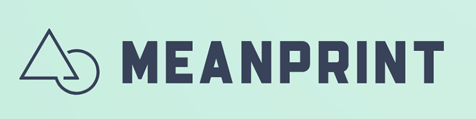

  
 

#### :abacus: A Ready-to-Deploy MEAN-Stack Template.

## Introduction
#### What is the MEAN Blueprint?
The general idea is to have a ready-to-deploy MEAN stack template to quickly stage and deploy applications without needing to do any back-end configuration or custom setup (at least initially). Far too often prototyping necessitates server configuration, installation of necessary middleware, etc. Meanprint was created in an effort to streamline the process and reduce the friction between concept to product.  

## Table of Contents

- [System Requirements](#system-requirements)
- [Installation](#installation)
- [Configuration](#configuration)
- [Usage](#usage)
- [Roles & Permissions](#roles--permissions)
- [Features](#features)
- [Updates](#updates)
- [Contributing](#contributing)
- [License](#license)
- [Credits](#credits)

## System Requirements

Mostly for my own documentation through development, Meanprint currently utilizes the following application infrastructure:

Focus                             |  Tool(s)
----------------------------------|------------------------------------------------------------------------------------
Syntax                            | Javascript
Compiler                          | ESLint
View Engine                       | Pug
Build Automation                  | Grunt
Package Management                | Bower
Testing                           | Jasmine or Karma

## Installation

In development

## Configuration

In development

## Usage

In development

## Features

In development

## Updates

In development

## Contributing

In development

## Credits

In development

Please :star: the project if you enjoy it - much appreciated!