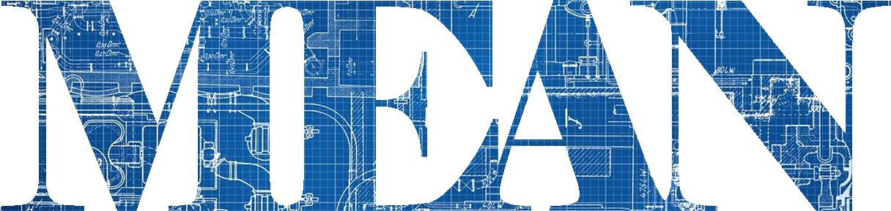

 

#### A Ready-To-Go MEAN-Stack Template.

## Introduction
#### What is the MEAN Blueprint?
The general idea is to have a ready-to-go MEAN stack template to quickly stage and deploy applications without needing to do any back-end configuration or custom setup (at least initially). Far too often you just want to test an application concept but first need to configure the server, install necessary middleware, etc. This is intended to alleviate some of these headaches. 

## The Technical
#### Getting Started

## Usage
TODO

## Mumbo-Jumbo™
TODO

